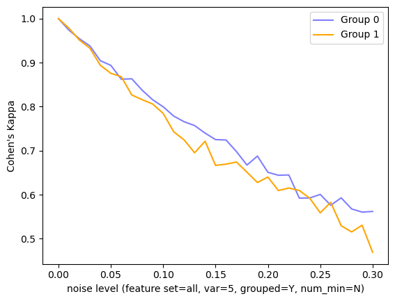
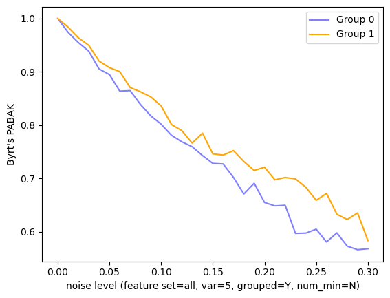
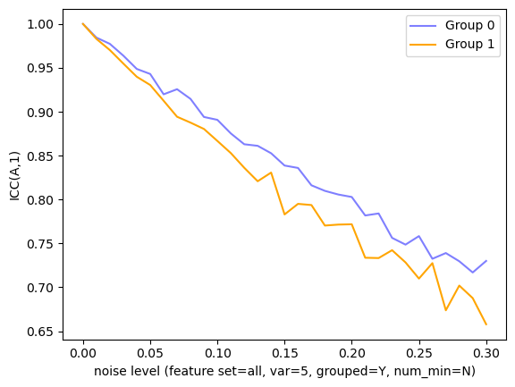

# Reliability Gaps Between Groups in COMPAS Dataset

This repository is the official implementation of [Reliability Gaps Between Groups in COMPAS Dataset](http://arxiv.org/abs/2308.15243) by Tim Räz. It explores the question whether there are interrater reliability gaps between socially salient groups on the COMPAS dataset. The main finding is that there are such gaps, but they depend on the kind of reliability statistic that is employed.

## Requirements

The code was written and tested with Python 3.9.13 and Jupyter notebooks. To install requirements, run:

```setup
pip install -r requirements.txt
```
or install the packages in the requirements file manually.
## Data

The dataset is in the folder `/data`. It is taken from [Hertweck and Räz 2022](https://github.com/hcorinna/gradual-compatibility), which in turn is based on [Friedler et al. 2019](https://github.com/algofairness/fairness-comparison).

## Training

To train the models, run the first code cell in `interrater_compas.ipynb`. The models (logistic regression models from sklearn) are usually trained in seconds.

## Evaluation

To perform perturbations and obtain interrater reliability statistics as discussed in the paper, run the corresponding cell in `interrater_compas.ipynb`. The main experiments are in the code cell under **Perturbation of all features, variance = 1, 5, 10**. Further experiments are in subsequent cells. The computation can take a few minutes. To run different experiments, modify the `parameter_experiment` dictionary in the notebook.

## Results

Results are saved to the folder `/results` in .csv format. Plots are saved to the folder `/figures`. Sample figures:




